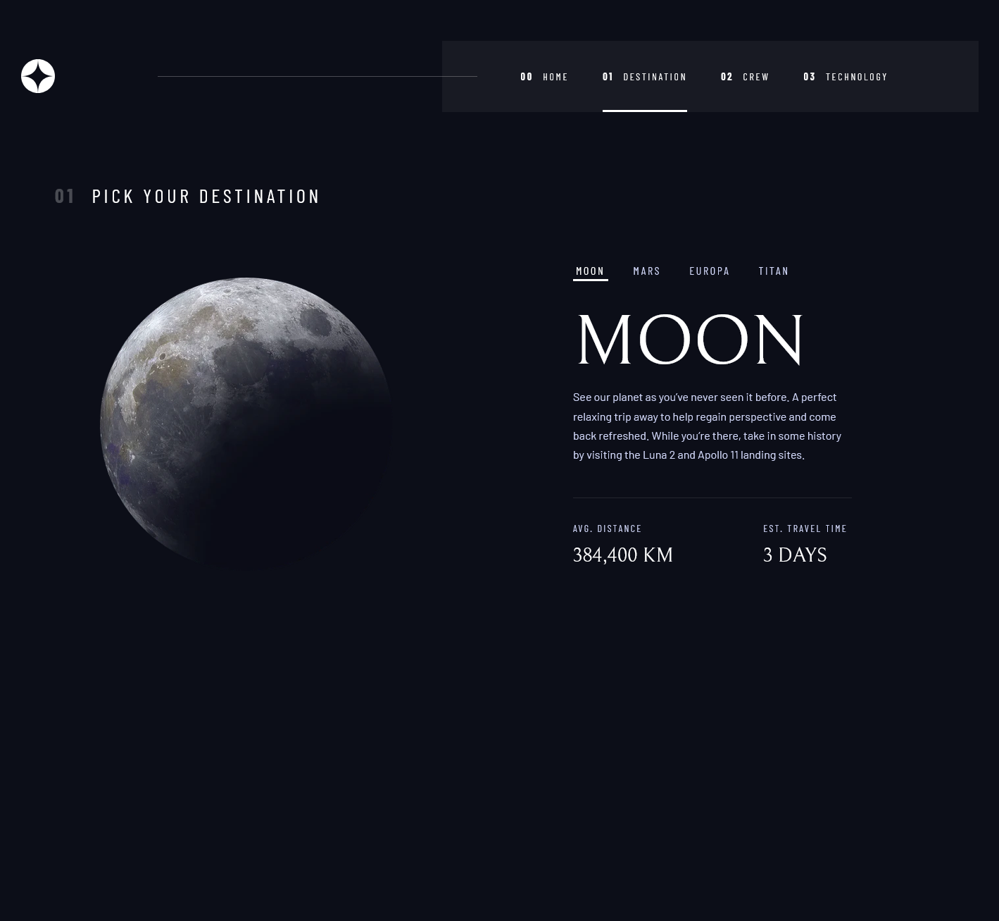
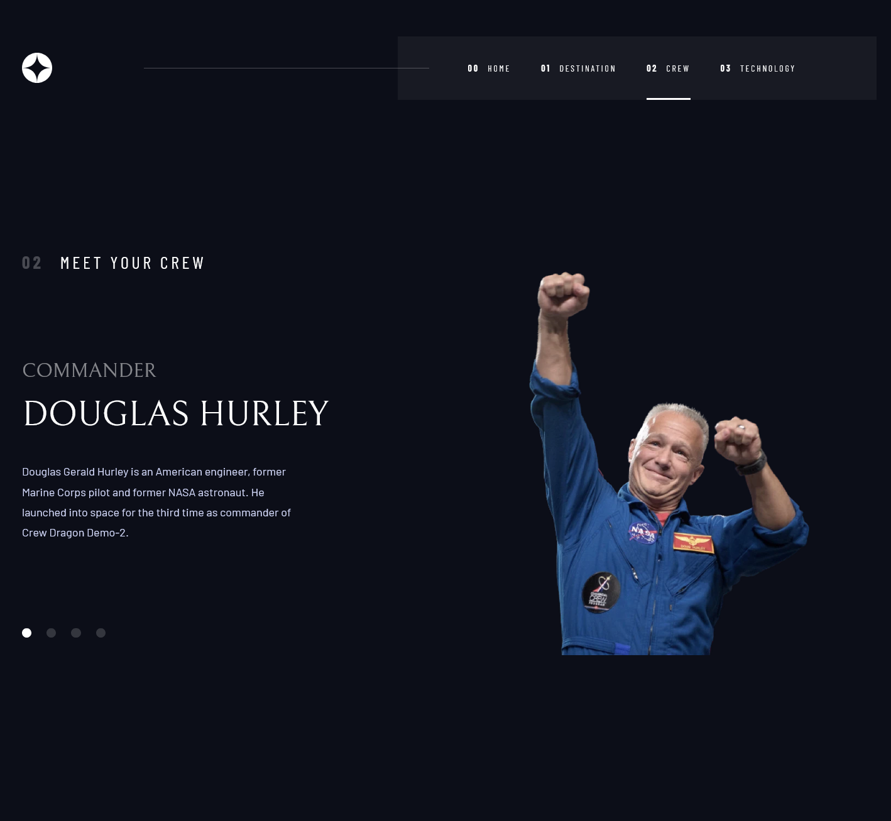

# Frontend Mentor - Space Tourism Multi-Page Website Solution

This is a solution to the [Space tourism website challenge on Frontend Mentor](https://www.frontendmentor.io/challenges/space-tourism-multipage-website-gB862L1QI). Frontend Mentor challenges help you improve your coding skills by building realistic projects. 

## Table of contents

- [Overview](#overview)
  - [The challenge](#the-challenge)
  - [Screenshot](#screenshot)
  - [Links](#links)
- [My process](#my-process)
  - [Built with](#built-with)
  - [What I learned](#what-i-learned)
- [Author](#author)

## Overview

### The challenge

Users should be able to:

- View the optimal layout for each of the website's pages depending on their device's screen size
- See hover states for all interactive elements on the page
- View each page and be able to toggle between tabs to see new information (Destinations, Crew, and Technology)

### Screenshot

<table>
  <tr>
    <td width="50%"></td>
    <td width="50%"></td>
  </tr>
  <tr>
    <td width="50%"></td>
    <td width="50%"></td>
  </tr>
</table>

### Links

- [Solution](https://github.com/Kking927/space-tourism-multi-page-website)
- [Live Site](https://kking927.github.io/space-tourism-multi-page-website/)

## My process

### Built with

- Semantic HTML5 markup
- CSS Custom Properties
- Flexbox
- CSS Grid
- Mobile-first workflow
- Vanilla JavaScript

### What I learned

During this project, I got practice connecting a multi-page site and using JavaScript data matrices to dynamically handle user interactions and state changes.

* **Connecting a Multi-Page Site Architecture:** Managed page states and routing across multiple HTML files (`index.html`, `destination.html`, `crew.html`, and `technology.html`) while keeping a cohesive global layout. To avoid repeating global CSS rules while maintaining page-specific identities, I assigned distinct page classes to the `<body>` element (e.g., `<body class="page-destination">`). This allowed a single master stylesheet to dynamically set viewport background media and layout constraints based on the active page.

* **Data Matrices & Dynamic State Swaps in JavaScript:** Used JavaScript to store site information in a structured data matrix/object and update DOM elements without full page reloads. By reading `data-*` attributes from interactive tabs (such as tab buttons or slider dots), I mapped user selection indices directly to the data matrix to smoothly update names, descriptions, metrics, and image sources in real time.

```js
// Example: Using tab index to fetch content from a data matrix and update the page
const updateTabContent = (targetIndex) => {
  const selectedData = dataMatrix[targetIndex];
  
  // Updating text content and image sources dynamically
  itemNameElement.textContent = selectedData.name;
  itemDescriptionElement.textContent = selectedData.description;
  itemImageElement.src = selectedData.images.png;
};
```

 ## Author


- Frontend Mentor - [@Kking927](https://www.frontendmentor.io/profile/Kking927) 
